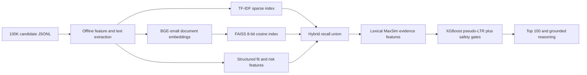

# Bug Solvers Redrob Candidate Ranker

CPU-only, deterministic candidate discovery and ranking for the Redrob Intelligent Candidate Discovery & Ranking Challenge.

## Architecture



1. `precompute.py` streams every candidate and creates career, profile, weighted-skill, compressed-evidence, and structured feature artifacts.
2. TF-IDF supplies sparse recall across all candidates.
3. `BAAI/bge-small-en-v1.5` creates normalized 384-dimensional evidence embeddings offline.
4. FAISS stores those vectors in an 8-bit scalar-quantized inner-product index. Normalized inner product is cosine similarity.
5. Candidate generation unions FAISS, TF-IDF, SVD fallback, exact rule recall, and title recall into an 8K-15K pool.
6. A CPU-safe lexical MaxSim layer scores JD aspects over compressed evidence. It is an honest ColBERT fallback and reports `colbert_available=0`.
7. XGBoost combines retrieval and structured signals. A transparent weighted formula is used if the model is missing.
8. Strong gates suppress inconsistent profiles, keyword stuffers, pure services profiles, and candidates without production evidence.
9. Output sorting is deterministic by final score and then `candidate_id`. Reasoning uses stored candidate facts only.

## Environment

The tested environment is Python 3.11 in repository-local `.venv`.

```powershell
py -3.11 -m venv .venv
& .\.venv\Scripts\Activate.ps1
python -m pip install -r requirements.txt
```

The core rank command requires no API key, Ollama, Docker, GPU, hosted model, or network access.

## Build Artifacts

Download the public embedding model once:

```powershell
python download_model.py
```

Build all base and neural artifacts:

```powershell
python precompute.py --candidates India_runs_data_and_ai_challenge/candidates.jsonl --artifacts-dir artifacts
```

For an existing base precompute, build only the resumable neural index:

```powershell
python build_neural_index.py --artifacts-dir artifacts --model-path models/bge-small-en-v1.5
```

Neural document encoding is offline precomputation. The final rank command loads only the compact FAISS index and saved query vector; it does not load PyTorch or the embedding model.

Measured locally at below-normal process priority:

- Base feature/index precompute: about 3.3 minutes.
- BGE embedding and FAISS build: about 61.9 minutes.
- Final offline rank: about 5.4 seconds.
- Final production artifacts: about 325 MB.

## Rank And Validate

```powershell
python rank.py --candidates India_runs_data_and_ai_challenge/candidates.jsonl --artifacts-dir artifacts --out submission.csv
python India_runs_data_and_ai_challenge/validate_submission.py submission.csv
python -m unittest discover -s tests -v
python run_checks.py --candidates India_runs_data_and_ai_challenge/candidates.jsonl --submission submission.csv --artifacts-dir artifacts
```

If base artifacts are absent, `rank.py` invokes deterministic CPU precomputation with neural indexing disabled, then ranks with the SVD fallback. This makes a fresh checkout functional while keeping neural precomputation explicit.

## Hosted Sample Demo

`app.py` is a Gradio interface for the portal's small-sample requirement. It accepts JSON or JSONL containing at most 100 candidates and returns a ranked CSV. It reuses the production feature extraction, safety gates, lexical evidence matching, and grounded reasoning without external API calls.

For a Hugging Face Gradio Space, use `app.py` and install `requirements-space.txt`. Deployment is completed after the Space account and URL are supplied.

## Main Signals

- Production search, retrieval, ranking, recommendation, embedding, vector-database, and evaluation evidence.
- Current and historical role fit, hands-on Python, product engineering, and company context.
- Skill trust from career corroboration, assessment, duration, endorsements, and proficiency.
- Experience, location/relocation, notice period, recruiter response, activity, and open-to-work signals.
- Duration inconsistencies, expert skills with no duration, title mismatch, nontechnical AI stuffing, and services-only careers.

Profiles with both `honeypot_risk >= 0.30` and `consistency_score < 0.65` receive a strong final gate.

## Reproducibility

- CPU-only ranking with offline environment variables enforced by `run_checks.py`.
- No hosted API calls or manual CSV edits.
- Pinned direct dependencies.
- Deterministic output hash across repeated runs.
- Artifact and runtime limits are checked before final submission.

Implementation choices follow the official [Sentence Transformers semantic-search guidance](https://www.sbert.net/examples/sentence_transformer/applications/semantic-search/README.html), [BGE model card](https://huggingface.co/BAAI/bge-small-en-v1.5), [FAISS index documentation](https://github.com/facebookresearch/faiss/wiki/Faiss-indexes), and [XGBoost learning-to-rank documentation](https://xgboost.readthedocs.io/en/stable/tutorials/learning_to_rank.html).


