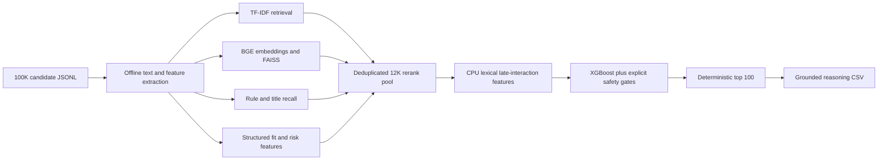

# Bug Solvers Redrob Candidate Ranker

Deterministic, explainable, CPU-only candidate discovery and ranking for the Redrob Data and AI Challenge.

- **Live demo:** [Hugging Face Space](https://huggingface.co/spaces/optimumpride/bug-solvers-redrob-ranker)
- **Team:** Bug Solvers
- **Target role:** Senior AI Engineer, Founding Team
- **Dataset:** 100,000 candidate profiles

## What We Built

The system selects and ranks the best 100 candidates for the released job description. It is designed to recognize credible production search, retrieval, ranking, recommendation, evaluation, and Python engineering experience without rewarding keyword stuffing.

The final pipeline combines:

- BGE sentence embeddings and FAISS semantic retrieval.
- TF-IDF unigram/bigram lexical retrieval.
- Exact evidence and technical-title recall.
- Structured career, product, experience, location, and behavioral features.
- Semantic narrative analysis for strong profiles written in plain language.
- XGBoost weak-supervision reranking with a transparent formula fallback.
- Consistency, honeypot, zero-duration skill, and keyword-stuffing protections.
- Deterministic, evidence-grounded reasoning for every selected candidate.

## Why It Stands Out

1. **Evidence over keywords:** career descriptions and production ownership matter more than skill lists.
2. **Hybrid retrieval:** dense, sparse, title, and rule recall reduce blind spots.
3. **Adversarial-profile resistance:** inconsistent or implausible profiles are explicitly penalized.
4. **Behavior-aware ranking:** availability, response rate, activity, notice period, and relocation modify technical fit.
5. **Fully offline final ranking:** no hosted API, LLM call, or network access is used during inference.
6. **Deterministic output:** fixed seeds and candidate-ID tie-breaking produce byte-identical reruns.

## Architecture



The late-interaction layer is a transparent CPU lexical MaxSim fallback. It reports that contextual ColBERT is unavailable and never claims that a ColBERT model ran.

## Verified Results

| Check | Verified result |
|---|---:|
| Candidate profiles processed | 100,000 |
| Final output | 100 unique candidates |
| Final ranking runtime | 15.6 seconds |
| Deterministic integration rerun | 18.4 seconds |
| Peak ranking working set | approximately 1.9 GB |
| Precomputation | approximately 74 minutes |
| Generated artifacts | approximately 325 MB |
| Organizer validator | Pass |
| Automated tests | 12/12 passing |
| GPU required | No |
| Network during ranking | No |

Verified submission SHA-256:

```text
17C219DF15032204934B30C078DE5939969DD546BC5DEA4C330F7861991D68C7
```

## Hosted Demo

The [live Gradio sandbox](https://huggingface.co/spaces/optimumpride/bug-solvers-redrob-ranker) accepts a JSON list or JSONL file containing up to 100 candidates and returns a ranked CSV.

Use the organizer-provided sample:

```text
India_runs_data_and_ai_challenge/sample_candidates.json
```

The hosted sandbox demonstrates sample ranking with the same feature extraction, safety gates, evidence matching, and reasoning logic. The complete 100,000-candidate FAISS/XGBoost pipeline runs locally using the commands below.

## Local Setup

### Requirements

- Python 3.11
- CPU with up to 16 GB RAM
- Git
- Organizer-provided `candidates.jsonl`
- Internet access only for initial package and model installation

Place the full dataset at:

```text
India_runs_data_and_ai_challenge/candidates.jsonl
```

### Windows PowerShell

```powershell
cd "path\to\redrob_ai_challenge"
py -3.11 -m venv .venv
& .\.venv\Scripts\Activate.ps1
python -m pip install -r requirements.txt
python download_model.py
```

### Linux or macOS

```bash
cd path/to/redrob_ai_challenge
python3.11 -m venv .venv
source .venv/bin/activate
python -m pip install -r requirements.txt
python download_model.py
```

All packages are installed inside the repository-local virtual environment.

## Reproduce The Submission

Full first-time reproduction, including precomputation when artifacts are absent:

```powershell
python reproduce.py --candidates India_runs_data_and_ai_challenge/candidates.jsonl --artifacts-dir artifacts --out submission.csv
```

Exact ranking command after precomputation:

```powershell
python rank.py --candidates India_runs_data_and_ai_challenge/candidates.jsonl --artifacts-dir artifacts --out submission.csv
```

The final ranking command is CPU-only, deterministic, offline, and below the five-minute limit.

## Validate And Test

Organizer validation:

```powershell
python India_runs_data_and_ai_challenge/validate_submission.py submission.csv
```

Full integration and determinism checks:

```powershell
python run_checks.py --candidates India_runs_data_and_ai_challenge/candidates.jsonl --submission submission.csv --artifacts-dir artifacts
```

Unit tests:

```powershell
python -m unittest discover -s tests -v
```

Optional diagnostic regression check:

```powershell
python evaluate_proxy.py --candidates India_runs_data_and_ai_challenge/candidates.jsonl --submission submission.csv --artifacts-dir artifacts
```

The proxy evaluator is a local regression guard, not organizer ground truth or a leaderboard estimate.

## Output Contract

The generated UTF-8 CSV contains exactly:

```text
candidate_id,rank,score,reasoning
```

The ranker enforces:

- Exactly 100 unique candidates for the full dataset.
- Ranks 1 through 100.
- Monotonically decreasing scores.
- Deterministic candidate-ID tie-breaking.
- Reasoning grounded only in candidate profile evidence.

## Repository Guide

```text
rank.py                         Final constrained ranking command
precompute.py                   Text, feature, TF-IDF, SVD, FAISS and model build
reproduce.py                    Full reproducible pipeline
retrain_ranker.py               Retrieval-aware XGBoost training
build_neural_index.py           Resumable BGE embedding and FAISS construction
redrob_ranker/features.py       Features, safety gates, labels and reasoning
redrob_ranker/late_interaction.py  CPU lexical late interaction
redrob_ranker/neural_retrieval.py Neural encoding and FAISS utilities
app.py                          Gradio hosted demo
build_space_package.py          Minimal Space package builder
run_checks.py                   Integration, safety, runtime and determinism tests
audit_submission.py             Fact-level top-100 audit
tests/test_ranker.py            Unit tests
submission_metadata.yaml        Submission declarations and compute metadata
```

Raw candidate data, generated artifacts, local models, virtual environments, submissions, credentials, and private planning documents are excluded from Git.

## Team

- Virendra Pawar
- Sarthak Kotkar
- Rohan Mohite
- Soham Miniyar

## AI Usage Declaration

OpenAI Codex was used for architecture research, implementation assistance, debugging, testing, and documentation. The ranking pipeline itself does not call Codex, an LLM, or any hosted API. AI-assisted development is also declared in `submission_metadata.yaml`.

## Technical References

- [BGE-small model](https://huggingface.co/BAAI/bge-small-en-v1.5)
- [FAISS](https://github.com/facebookresearch/faiss)
- [XGBoost learning to rank](https://xgboost.readthedocs.io/en/stable/tutorials/learning_to_rank.html)
- [Sentence Transformers semantic search](https://www.sbert.net/examples/sentence_transformer/applications/semantic-search/README.html)