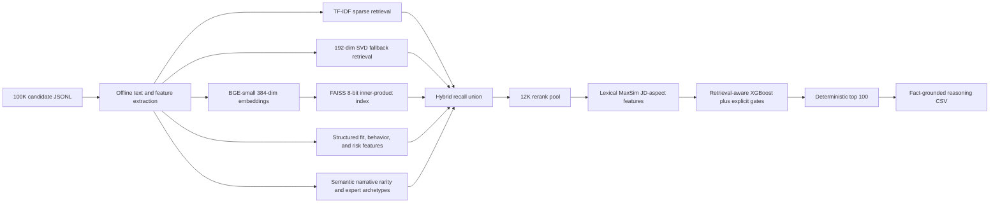

# Bug Solvers Redrob Candidate Ranker

Deterministic, CPU-only candidate discovery and ranking for the Redrob Intelligent Candidate Discovery & Ranking Challenge.

## Current Status

- Team: **Bug Solvers**
- Dataset processed locally: 100,000 candidates
- Tested compute: 16 logical CPU cores and 16 GB RAM
- Output: exactly 100 ranked candidates
- Final rank runtime: approximately 9-15 seconds internally on the tested laptop
- Measured peak ranking working set: approximately 1.9 GB
- Offline precompute: approximately 65-75 minutes with BGE neural embeddings; feature-only refresh approximately 6.8 minutes
- Production artifact size: approximately 325 MB
- Organizer CSV validator: passing
- Deterministic offline rerun: passing and byte-identical
- Neural retrieval: `BAAI/bge-small-en-v1.5` plus FAISS
- Final ML model: retrieval-aware XGBoost weak-supervision regressor
- Verified improved submission SHA-256: `17C219DF15032204934B30C078DE5939969DD546BC5DEA4C330F7861991D68C7`
- Hosted demo: deployed and live at `https://huggingface.co/spaces/optimumpride/bug-solvers-redrob-ranker`

No hidden-ground-truth labels are provided by the organizers. The solution therefore uses transparent weak supervision, explicit evidence features, adversarial-profile gates, organizer samples, and manual top-rank auditing. No solution can honestly guarantee the hidden leaderboard result before evaluation.

## Challenge Objective

Rank the best 100 candidates for a Senior AI Engineer founding-team role. The important evidence is not a list of AI keywords. The system prioritizes:

- Production search, retrieval, ranking, recommendation, and embedding systems.
- Evaluation experience such as NDCG, MRR, MAP, offline judgments, and A/B testing.
- Recent hands-on Python and production engineering.
- Product-company and startup shipping evidence.
- Approximately 5-9 years of experience, treated as a preference rather than a hard rule.
- Availability, location/relocation, response rate, notice period, and recent activity.
- Cross-field consistency and resistance to keyword stuffing or impossible profiles.

## Architecture



### Offline Precompute

`precompute.py` streams every candidate and creates five text views:

- `career_text`: titles, companies, industries, and career descriptions.
- `profile_text`: headline and summary.
- `skills_text`: skills weighted by proficiency, duration, endorsements, and assessment.
- `evidence_text`: compressed JD-relevant sentences and phrases.
- `all_text`: combined normalized text for feature extraction.

It also creates structured features covering title fit, career evidence, retrieval/ranking depth, production ML, evaluation, Python, company context, experience, location, behavior, skill trust, consistency, honeypot risk, stuffing, services-only history, and other disqualifiers.

Career descriptions have only 44 distinct narratives across 300,171 jobs and form six sharply separated frequency bands. The ranker treats rarity as an information prior only when the narrative also contains semantic search, ranking, recommendation, matching, production, or evaluation evidence. This recovers rare plain-language expert profiles without promoting arbitrary rare text or hard-coding candidate IDs.

### Hybrid Candidate Generation

`rank.py` unions and deduplicates candidates from:

- BGE and FAISS semantic retrieval.
- TF-IDF unigram/bigram retrieval.
- SVD semantic fallback.
- Exact rule/evidence recall.
- Technical-title recall.

The union is deterministically trimmed to 12,000 candidates for final reranking.

### Neural Retrieval

- Model: `BAAI/bge-small-en-v1.5`
- License: MIT
- Parameters: approximately 33.4 million
- Embedding dimension: 384
- Maximum candidate sequence length: 128 tokens
- Candidate representation: compressed evidence followed by the first high-signal career text
- Query instruction: `Represent this sentence for searching relevant passages:`
- Similarity: normalized inner product, equivalent to cosine similarity
- FAISS index: `IndexScalarQuantizer`, 8-bit, inner-product metric
- Index size: approximately 36.6 MB for 100,000 candidates

The scalar-quantized index achieved approximately 99% recall@100 against a flat index in the local index sanity benchmark.

### Late Interaction

The instructions allow ColBERT to fall back when its model/index/runtime cost is unsuitable. The production build uses a transparent CPU lexical MaxSim approximation over compressed evidence. It tokenizes each candidate once, caches JD query tokens, and scores retrieval, ranking, evaluation, production, Python, shipping, and fine-tuning aspects. It reports `colbert_available=0` and never pretends that contextual ColBERT ran.

### Cross-Encoder Experiment

A 22.7M-parameter MiniLM cross-encoder was benchmarked on the top 300 and intentionally rejected from production. It scored 300 pairs in 9.591 seconds and separated the rare expert band from the rest with AUC 0.7438, but it strongly preferred explicit keyword-heavy profiles and under-scored the organizer's plain-language expert archetypes. A 5% blend produced no proxy gain; larger blends displaced expert candidates. The production ranker therefore remains smaller, faster, and less vulnerable to wording style.

### Final ML Reranker

`retrain_ranker.py` trains an `XGBRegressor` over structured and real retrieval features. Weak labels combine:

- 88% transparent pseudo-relevance rubric.
- 5% normalized sparse retrieval relevance.
- 7% normalized dense retrieval relevance.

The model uses 220 trees, depth 4, learning rate 0.035, histogram training, fixed random seed 42, and CPU inference. The saved training report confirms nonzero learned importance for dense, sparse, and rule-recall features.

At inference, the model prediction is blended with the transparent weighted formula. Explicit final bonuses preserve the JD's priority on production ML, product-company context, and experience fit.

### Transparent Base Formula

The structured base score is:

```text
0.24 career_system_fit
0.16 retrieval_ranking_depth
0.11 production_ml_depth
0.10 evaluation_experimentation_fit
0.08 product_company_fit
0.07 experience_fit
0.05 python_engineering_fit
0.05 location_relocation_fit
0.08 behavioral_availability_fit
0.04 skill_trust_score
0.02 market_signal_score
```

### Safety Gates

Multiplicative gates strongly reduce:

- High honeypot risk.
- Profiles with `honeypot_risk >= 0.30` and `consistency_score < 0.65`.
- Nontechnical AI keyword stuffers.
- Pure IT-services histories without product/retrieval evidence.
- Profiles without production evidence.
- Outside-India candidates unwilling to relocate.
- Long-inactive profiles with poor response rates.

Additional penalties cover keyword stuffing and title mismatch. Experience outside 5-9 years remains a mild preference penalty, not automatic rejection.

### Reasoning

Reasoning is deterministic and uses only extracted candidate facts:

- Current title and years of experience.
- Strongest source evidence from the profile/career record.
- Location, response, notice, or availability when useful.
- An honest concern when applicable.
- Rank-aware tone and deterministic phrasing variation across retrieval, evaluation, production, and product themes.

There are no hosted LLM calls and no generated facts during ranking.

## Repository Layout

```text
app.py                         Gradio sample demo
artifacts/                     Generated production artifacts; intentionally Git-ignored
build_neural_index.py          Resumable BGE embedding and FAISS builder
build_space_package.py          Minimal self-contained Hugging Face Space package builder
demo_ranker.py                 <=100-candidate hosted-demo ranking core
download_model.py              One-time public BGE model downloader
evaluate_proxy.py              Transparent local archetype regression evaluator
precompute.py                  End-to-end offline artifact generation
rank.py                        Constrained no-network ranking command
reproduce.py                   Single full neural reproduction command
retrain_ranker.py              Retrieval-aware XGBoost training
audit_submission.py           Fact-level top-100 audit report
run_checks.py                  Full integration and determinism checks
redrob_ranker/features.py      Text views, features, gates, pseudo labels, reasoning
redrob_ranker/late_interaction.py  CPU lexical MaxSim fallback
redrob_ranker/neural_retrieval.py Resumable neural encoding and FAISS utilities
tests/test_ranker.py           Unit tests
requirements.txt               Pinned production/development dependencies
requirements-space.txt         Minimal local hosted-demo dependencies
submission_metadata.yaml       Portal and Stage-3 metadata
```

Private planning files, raw candidate data, local models, generated artifacts, audits, virtual environments, and submissions are excluded by `.gitignore`.

## Data And Public-Repository Policy

This GitHub repository is public. Therefore it intentionally does **not** contain:

- `candidates.jsonl`.
- Candidate-derived Parquet text/features.
- FAISS, TF-IDF, SVD, or XGBoost artifacts.
- Generated submission or audit CSV files.
- Local Hugging Face model files.
- Contact credentials, API keys, or environment files.

Publishing `candidate_text_views.parquet` would expose derived candidate profile content, so artifacts must be generated locally from the organizer-provided data. This is supported by the challenge's reproducible-precomputation rule.

Place the organizer dataset at:

```text
India_runs_data_and_ai_challenge/candidates.jsonl
```

## Prerequisites

- Windows, Linux, or macOS.
- Python 3.11 recommended. Tested with Python 3.11.5.
- CPU inference only; no GPU required.
- Git for cloning.
- Sufficient disk space for the dataset, local model, virtual environment, and approximately 325 MB of generated artifacts.
- Network access is needed only for initial package/model installation, never for final ranking.

No paid API key, Ollama, Docker, or Hugging Face login is required for local ranking. A Hugging Face account/token is needed only when deploying the optional Space.

## Setup

### Windows PowerShell

```powershell
py -3.11 -m venv .venv
& .\.venv\Scripts\Activate.ps1
python -m pip install -r requirements.txt
```

### Linux Or macOS

```bash
python3.11 -m venv .venv
source .venv/bin/activate
python -m pip install -r requirements.txt
```

All Python packages must be installed inside `.venv`.

## Rebuild The Winning Artifacts

Download the public embedding model once:

```powershell
python download_model.py
```

Build text views, structured features, TF-IDF, SVD, BGE embeddings, FAISS, and the retrieval-aware XGBoost model:

```powershell
python precompute.py --candidates India_runs_data_and_ai_challenge/candidates.jsonl --artifacts-dir artifacts
```

The neural encoder checkpoints every 1,024 candidates to:

```text
artifacts/neural_embeddings.progress.json
artifacts/neural_embeddings.tmp.npy
```

If interrupted, run the same command again and it resumes from the last completed checkpoint. Temporary embedding files are removed after the FAISS index is written.

When only structured feature logic changes, preserve retrieval indexes and refresh features plus XGBoost:

```powershell
python precompute.py --candidates India_runs_data_and_ai_challenge/candidates.jsonl --artifacts-dir artifacts --features-only
```

When base artifacts already exist, rebuild only neural retrieval and retrain XGBoost:

```powershell
python build_neural_index.py --artifacts-dir artifacts --model-path models/bge-small-en-v1.5
```

### Fast Functional Fallback

To build a fully functional non-neural baseline:

```powershell
python precompute.py --candidates India_runs_data_and_ai_challenge/candidates.jsonl --artifacts-dir artifacts --skip-neural
```

If base artifacts are missing, `rank.py` automatically invokes this deterministic SVD fallback precompute. On the tested laptop, base precompute plus ranking remains under the five-minute limit. The final competition CSV in this workspace was produced with BGE and FAISS artifacts, not the fallback.

## Produce The Submission

Full neural artifact rebuild plus submission generation (precomputation may exceed the five-minute ranking window):

```powershell
python reproduce.py --candidates India_runs_data_and_ai_challenge/candidates.jsonl --artifacts-dir artifacts --out submission.csv
```

Exact Stage-3 ranking command after documented precomputation:

```powershell
python rank.py --candidates India_runs_data_and_ai_challenge/candidates.jsonl --artifacts-dir artifacts --out submission.csv
```

Output columns are exactly:

```text
candidate_id,rank,score,reasoning
```

The ranker enforces:

- Exactly 100 unique candidates.
- Ranks 1 through 100.
- Strictly descending rounded scores.
- Deterministic `candidate_id` ascending tie-break.
- UTF-8 CSV output.

## Validate And Audit

Run unit tests:

```powershell
python -m unittest discover -s tests -v
```

Run the organizer validator:

```powershell
python India_runs_data_and_ai_challenge/validate_submission.py submission.csv
```

Run full integration checks:

```powershell
python run_checks.py --candidates India_runs_data_and_ai_challenge/candidates.jsonl --submission submission.csv --artifacts-dir artifacts
```

Evaluate against the transparent local archetype proxy:

```powershell
python evaluate_proxy.py --candidates India_runs_data_and_ai_challenge/candidates.jsonl --submission submission.csv --artifacts-dir artifacts
```

The proxy uses empirical narrative-frequency bands and is explicitly not organizer ground truth. It is a regression guard for the dataset's known plain-language expert pattern, not a leaderboard estimate.


Create a fact-level audit CSV for manual top-10/top-50 review:

```powershell
python audit_submission.py --submission submission.csv --artifacts-dir artifacts --out artifacts/submission_audit.csv
```

`run_checks.py` verifies:

- Organizer format validation.
- Exactly 100 rows and unique candidate IDs.
- Strictly descending scores and ranks 1-100.
- Every selected ID exists in the full JSONL.
- Candidate title appears in its reasoning.
- No high-risk inconsistent profile is selected.
- No candidate with three or more zero-duration expert skills is selected.
- Known obvious sample traps do not enter the top 50.
- The clear sample recommendation engineer remains in scope.
- Ranking modules contain no common network-client imports.
- Offline environment variables are set during rerun.
- A second rank produces an identical SHA-256 file hash.
- Ranking stays below five minutes.

## Measured Results

Tested on Windows with Python 3.11.5 and 16 logical CPU cores:

| Measurement | Result |
|---|---:|
| Candidate count | 100,000 |
| Base precompute | about 11.8 minutes for latest full CPU refresh |
| Feature-only refresh | about 6.8 minutes |
| BGE plus FAISS precompute | about 61.9 minutes at below-normal priority |
| Total offline precompute | about 73-75 minutes from measured stages |
| Final rank | about 9-15 seconds internal time |
| Peak ranking working set | about 1.9 GB |
| Rerank pool | 12,000 |
| Pool sensitivity | same top-100 membership at 8K, 12K, and 15K |
| Production artifacts | about 325.4 MB |
| FAISS index | about 36.6 MB |
| Organizer validator | Pass |
| Deterministic offline rerun | Pass |
| Local proxy NDCG@10 | 1.000000, up from 0.573505 |
| Local proxy NDCG@50 | 0.939534, up from 0.688359 |
| Local proxy composite | 0.844703, up from 0.556103 |
| Rare expert profiles in top 10 | 10, up from 2 |
| Unit tests | 12 passing |

Final top-10 audit means at the last verified run:

| Signal | Mean |
|---|---:|
| Career/system fit | 0.738 |
| Retrieval/ranking depth | 0.948 |
| Production ML depth | 0.825 |
| Evaluation/experimentation | 0.980 |
| Behavioral availability | 0.802 |
| Consistency | 0.989 |

The top 100 had no profile matching the strong inconsistency gate. The maximum-risk audit and all hard-penalty checks passed.

## Generated Artifacts

| Artifact | Approx. size | Purpose |
|---|---:|---|
| `candidate_text_views.parquet` | 94.25 MB | Career/profile/skill/evidence text views |
| `candidates_features.parquet` | 8.76 MB | Structured ranking and risk features |
| `tfidf_matrix.npz` | 95.37 MB | Sparse candidate matrix |
| `tfidf_vectorizer.joblib` | 0.80 MB | Sparse query encoder |
| `dense_embeddings.npy` | 73.24 MB | SVD fallback vectors |
| `dense_svd.joblib` | 15.72 MB | SVD query transform |
| `dense_index.faiss` | 36.62 MB | Quantized BGE candidate index |
| `dense_query_embedding.npy` | about 2 KB | Fixed JD BGE query vector |
| `ranker_model.joblib` | 0.36 MB | Retrieval-aware XGBoost model |
| `precompute_metadata.json` | small | Dimensions, timing, model and index metadata |
| `ranker_training_report.json` | small | Training source and feature importances |

## Hosted Demo

`app.py` is a Gradio interface for the portal's <=100-candidate demo requirement. It accepts a JSON list or JSONL file and returns a ranked CSV. It reuses production feature extraction, gates, lexical evidence matching, and deterministic reasoning without external API calls.

The demo uses a separate environment because Gradio 6 and the production Transformers stack currently require incompatible `huggingface-hub` version ranges. Keep `.venv` for ranking and create `.venv-demo` only for the interface:

```powershell
py -3.11 -m venv .venv-demo
& .\.venv-demo\Scripts\Activate.ps1
python -m pip install -r requirements-space.txt
python app.py
```

Local core-logic test from the production environment:

```powershell
python -c "from demo_ranker import rank_demo_file; print(rank_demo_file('India_runs_data_and_ai_challenge/sample_candidates.json', 'demo_output.csv'))"
```

Build the exact self-contained Hugging Face repository:

```powershell
python build_space_package.py
```

The generated `outputs/huggingface_space/` package contains root-level Space metadata, `app.py`, the ranking core, the public 50-profile sample, and only the required dependencies. It has been verified for deterministic CSV output, duplicate/invalid/oversized upload rejection, and local HTTP `200`. Hugging Face expects the YAML configuration at the top of the Space `README.md` and extra Python packages in root `requirements.txt`.

Deploy this generated directory to a public Gradio Space. The final `sandbox_link` must be added to `submission_metadata.yaml` after deployment. Hugging Face credentials must never be committed.

## Submission Metadata Still Required From The Team

Before portal upload, replace the `TODO` values in `submission_metadata.yaml`:

- Primary contact name, email, and phone.
- Team member names, emails, and roles.
- Registered participant/team ID.
- Hosted sandbox URL.

Then rename `submission.csv` to the exact participant/team filename required by the portal.

## Security And Safety

- No network calls occur in `rank.py`.
- No hosted LLM or API is used for candidate ranking or reasoning.
- `.env`, credentials, private keys, caches, editor files, models, artifacts, candidate data, audits, and submissions are ignored.
- The public model download uses a public MIT-licensed model and requires no token.
- Local package installation is confined to `.venv`.
- No administrator, registry, service, firmware, or global Python changes are required.
- AI-assisted development is declared in `submission_metadata.yaml`.

## Troubleshooting

### `FileNotFoundError` for candidates

Place the organizer JSONL at `India_runs_data_and_ai_challenge/candidates.jsonl` or pass its actual path through `--candidates`.

### Local BGE model is missing

Run:

```powershell
python download_model.py
```

### Neural build was interrupted

Run `build_neural_index.py` or `precompute.py` again with the same artifact directory. The checkpoint is resumed automatically.

### FAISS cannot load

The ranker prints the reason and falls back to SVD. Reinstall the pinned `faiss-cpu` version and rebuild `dense_index.faiss` for the current architecture.

### XGBoost model is missing

The ranker falls back to the transparent formula. Recreate the final model with:

```powershell
python retrain_ranker.py --artifacts-dir artifacts
```

### Ranking attempts network access

This is considered a release failure. `run_checks.py` statically scans ranking imports and reruns with Hugging Face/Transformers offline environment variables.

### Gradio is unavailable locally

The production ranker does not require Gradio. Create `.venv-demo` and install `requirements-space.txt` there, or let Hugging Face Spaces install it during deployment. Do not install the demo requirements into `.venv`.

## GitHub Publication Policy

The repository contains source, tests, sample organizer files, and documentation only. Generated candidate-derived artifacts are intentionally excluded because the repository is public. No Git LFS data upload is required for this safe publication path.

The configured remote is:

```text
https://github.com/POPPz07/redrob_ai_challenge.git
```

## Final Release Checklist

- [x] Repository-local `.venv` used for all packages.
- [x] Full 100K candidate precompute completed.
- [x] BGE and FAISS neural retrieval completed.
- [x] Retrieval-aware XGBoost trained.
- [x] Honeypot, chronology, and zero-duration expert-skill gates audited.
- [x] Plain-language expert archetypes recovered and proxy-regression tested.
- [x] Organizer validator passes.
- [x] Offline deterministic rerun passes.
- [x] Unit tests pass.
- [x] Artifact size is below 5 GB.
- [x] Rank runtime is below five minutes.
- [x] Public-repository secret scan passes.
- [x] Raw and derived candidate data excluded from Git.
- [x] Hosted-demo code implemented and local HTTP tested.
- [ ] Team/contact/participant metadata supplied.
- [x] Hugging Face Space deployed and URL recorded.
- [ ] Final portal filename applied.

## Technical References

- [Sentence Transformers semantic search](https://www.sbert.net/examples/sentence_transformer/applications/semantic-search/README.html)
- [Sentence Transformers retrieve and rerank](https://www.sbert.net/examples/sentence_transformer/applications/retrieve_rerank/README.html)
- [ColBERT official repository](https://github.com/stanford-futuredata/ColBERT)
- [BGE-small model card](https://huggingface.co/BAAI/bge-small-en-v1.5)
- [FAISS indexes](https://github.com/facebookresearch/faiss/wiki/Faiss-indexes)
- [XGBoost learning to rank](https://xgboost.readthedocs.io/en/stable/tutorials/learning_to_rank.html)
- [Hugging Face Spaces](https://huggingface.co/docs/hub/main/spaces-overview)
- [Hugging Face Spaces configuration](https://huggingface.co/docs/hub/spaces-config-reference)
- [scikit-learn NDCG](https://scikit-learn.org/stable/modules/generated/sklearn.metrics.ndcg_score.html)


